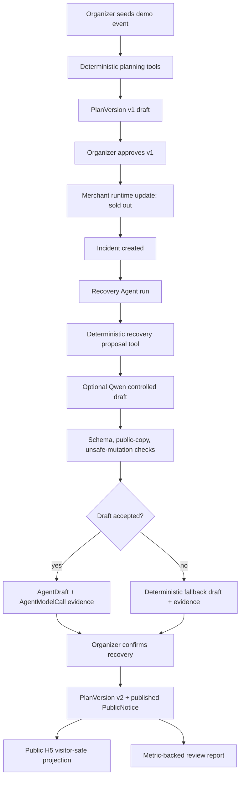

# Zhiyin Haojiang v1.1 Live Qwen Smoke And Demo Material Implementation Plan

> **For agentic workers:** REQUIRED SUB-SKILL: Use superpowers:subagent-driven-development (recommended) or superpowers:executing-plans to implement this plan task-by-task. Steps use checkbox (`- [ ]`) syntax for tracking.

**Goal:** Verify the optional live Qwen controlled-draft path once, keep deterministic fallback as the default, and package the Agent evidence into competition-ready demo materials.

**Architecture:** Add one guarded manual live-smoke script under `apps/api/scripts/` with offline unit tests for secret-safety and markdown rendering. Do not add live network calls to normal regression. Generate sanitized live-smoke evidence and competition materials under `docs/research/`, then update `docs/ai/` with actual verification results.

**Tech Stack:** FastAPI TestClient, Python 3.11, pytest, existing DashScope-compatible Qwen draft provider, Markdown, Mermaid, existing React/Vite/Playwright screenshot evidence.

---

## 0. Scope Lock

This plan implements:

```text
docs/proposal/v1.1-live-qwen-smoke-and-demo-material-spec.md
```

P0 scope:

- Add a guarded manual live Qwen smoke command.
- Keep normal `pytest`, Vitest, build, and Playwright runs independent of live DashScope access.
- Never write real API keys, Authorization headers, or raw secret-bearing env values to repo files.
- Record live smoke result as sanitized evidence.
- If live smoke cannot run, record it as blocked and preserve deterministic fallback evidence.
- Create competition demo materials:
  - `docs/research/v1.1-demo-script.md`
  - `docs/research/v1.1-architecture-brief.md`
  - `docs/research/v1.1-slide-outline.md`
  - `docs/research/v1.1-screenshot-index.md`
- Update `docs/ai/STATUS.md`, `docs/ai/VERIFY.md`, and `docs/ai/NEXT.md`.

Out of scope:

- No QwenPaw workflow.
- No model-generated `PlanVersion`.
- No model approval, publication, route mutation, merchant runtime mutation, auth/session mutation, or database migration.
- No real merchant, hardware, map, weather, traffic, POS, or payment integration.
- No broad frontend redesign.
- No live DashScope calls in default automated tests.

Implementation ordering rule:

```text
Tasks 1-2 add the guarded live-smoke tool.
Task 3 runs or records the live smoke.
Tasks 4-6 create competition materials.
Task 7 verifies and records handoff.
Stop after Task 7; do not start QwenPaw.
```

## 1. Target File Map

Backend script tests to create:

```text
apps/api/tests/test_v11_live_qwen_smoke_script.py
```

Backend script files to create:

```text
apps/api/scripts/__init__.py
apps/api/scripts/live_qwen_smoke.py
```

Frontend smoke files to create:

```text
apps/web/tests/e2e/v11-live-qwen-smoke-evidence.spec.ts
```

Research evidence files to create:

```text
docs/research/v1.1-live-qwen-smoke.md
docs/research/assets/v1.1-live-qwen-smoke/live-qwen-smoke-result.json
docs/research/assets/v1.1-live-qwen-smoke/01-live-exception-model-evidence.png
docs/research/assets/v1.1-live-qwen-smoke/02-live-review-model-evidence.png
```

Research material files to create:

```text
docs/research/v1.1-demo-script.md
docs/research/v1.1-architecture-brief.md
docs/research/v1.1-slide-outline.md
docs/research/v1.1-screenshot-index.md
```

Handoff files to modify:

```text
docs/ai/STATUS.md
docs/ai/VERIFY.md
docs/ai/NEXT.md
```

## 2. Compatibility Rules

Keep these existing rules intact:

```text
AGENT_DRAFT_BACKEND unset -> deterministic
AGENT_DRAFT_BACKEND=deterministic -> deterministic
AGENT_DRAFT_BACKEND=qwen without key -> skipped model calls and deterministic fallback
AGENT_DRAFT_BACKEND=qwen with valid live provider response -> controlled AgentDraft only
```

The live smoke may call:

```text
POST /api/events/demo/seed
POST /api/events/demo-night-tour/generate-plan
POST /api/events/demo-night-tour/plans/1/approve
POST /api/merchants/m001/runtime-state
GET  /api/events/demo-night-tour/agent-runs/{run_id}/model-calls
GET  /api/events/demo-night-tour/agent-runs/{run_id}/evaluations
POST /api/events/demo-night-tour/incidents/{incident_id}/recovery-proposals
POST /api/events/demo-night-tour/recovery-proposals/{proposal_id}/approve
POST /api/events/demo-night-tour/review-report
GET  /api/public/events/demo-night-tour
```

Forbidden changes:

- Do not change default backend mode to Qwen.
- Do not add `DASHSCOPE_API_KEY` to `.env`, docs, fixtures, screenshots, or git history.
- Do not add a package script that runs live Qwen by default.
- Do not weaken public-copy or unsafe-mutation guards to force a live success.
- Do not expose raw model/backend terms on merchant, tourist, or public H5 pages.

## 3. Task List

### Task 1: Live Smoke Script Contract Tests

**Purpose:** Add offline tests for the manual live-smoke script before writing the script. These tests must not call DashScope.

**Files:**

- Create: `apps/api/tests/test_v11_live_qwen_smoke_script.py`
- Later create: `apps/api/scripts/__init__.py`
- Later create: `apps/api/scripts/live_qwen_smoke.py`

- [ ] **Step 1: Write failing script contract tests**

Create `apps/api/tests/test_v11_live_qwen_smoke_script.py`:

```python
import pytest

from scripts.live_qwen_smoke import (
    ACCEPTED_MODEL_STATUSES,
    LiveSmokeConfigError,
    has_live_success,
    render_markdown,
    require_live_qwen_env,
    sanitize_model_call,
)


def test_live_smoke_env_requires_manual_guard(monkeypatch):
    monkeypatch.delenv("RUN_LIVE_QWEN_SMOKE", raising=False)
    monkeypatch.setenv("AGENT_DRAFT_BACKEND", "qwen")
    monkeypatch.setenv("DASHSCOPE_API_KEY", "test-key")

    with pytest.raises(LiveSmokeConfigError, match="RUN_LIVE_QWEN_SMOKE"):
        require_live_qwen_env()


def test_live_smoke_env_requires_qwen_backend(monkeypatch):
    monkeypatch.setenv("RUN_LIVE_QWEN_SMOKE", "1")
    monkeypatch.setenv("AGENT_DRAFT_BACKEND", "deterministic")
    monkeypatch.setenv("DASHSCOPE_API_KEY", "test-key")

    with pytest.raises(LiveSmokeConfigError, match="AGENT_DRAFT_BACKEND=qwen"):
        require_live_qwen_env()


def test_live_smoke_env_requires_provider_key(monkeypatch):
    monkeypatch.setenv("RUN_LIVE_QWEN_SMOKE", "1")
    monkeypatch.setenv("AGENT_DRAFT_BACKEND", "qwen")
    monkeypatch.delenv("DASHSCOPE_API_KEY", raising=False)

    with pytest.raises(LiveSmokeConfigError, match="DASHSCOPE_API_KEY"):
        require_live_qwen_env()


def test_live_smoke_env_returns_non_secret_config(monkeypatch):
    monkeypatch.setenv("RUN_LIVE_QWEN_SMOKE", "1")
    monkeypatch.setenv("AGENT_DRAFT_BACKEND", "qwen")
    monkeypatch.setenv("DASHSCOPE_API_KEY", "test-key")
    monkeypatch.setenv("QWEN_MODEL", "qwen-plus")

    config = require_live_qwen_env()

    assert config == {
        "agent_draft_backend": "qwen",
        "qwen_model": "qwen-plus",
        "qwen_timeout_seconds": "30",
    }


def test_sanitize_model_call_removes_raw_payload_and_headers():
    raw_call = {
        "model_call_id": "model_001",
        "run_id": "run_001",
        "provider": "dashscope",
        "model": "qwen-plus",
        "prompt_template_id": "qwen_public_notice_v1",
        "input_refs": ["incident:inc_inventory_m001"],
        "response_status": "success",
        "parsed_output": {"content": "full model content should not be copied here"},
        "fallback_used": False,
        "error_summary": None,
        "created_at": "2026-06-12T10:00:00Z",
        "Authorization": "Bearer sk-secret",
    }

    sanitized = sanitize_model_call(raw_call)

    assert sanitized["response_status"] == "success"
    assert sanitized["provider"] == "dashscope"
    assert "parsed_output" not in sanitized
    assert "Authorization" not in sanitized
    assert "sk-secret" not in str(sanitized)


def test_accepted_model_statuses_match_v10_contract():
    assert ACCEPTED_MODEL_STATUSES == {
        "skipped",
        "success",
        "invalid_json",
        "schema_failed",
        "provider_error",
    }


def test_has_live_success_only_counts_non_fallback_success():
    result = {
        "recovery": {"model_calls": [{"response_status": "schema_failed", "fallback_used": True}]},
        "review": {"model_calls": [{"response_status": "success", "fallback_used": False}]},
    }

    assert has_live_success(result) is True


def test_render_markdown_does_not_include_secret_values():
    result = {
        "date": "2026-06-12",
        "config": {
            "agent_draft_backend": "qwen",
            "qwen_model": "qwen-plus",
            "qwen_timeout_seconds": "30",
        },
        "outcome": "live_success",
        "recovery": {
            "run": {
                "run_id": "run_recovery",
                "mode": "qwen_draft",
                "status": "completed",
                "fallback_used": False,
            },
            "model_calls": [
                {
                    "model_call_id": "model_recovery",
                    "run_id": "run_recovery",
                    "provider": "dashscope",
                    "model": "qwen-plus",
                    "prompt_template_id": "qwen_public_notice_v1",
                    "input_refs": ["incident:inc_inventory_m001"],
                    "response_status": "success",
                    "fallback_used": False,
                    "error_summary": None,
                    "created_at": "2026-06-12T10:00:00Z",
                }
            ],
            "evaluations": [
                {
                    "evaluation_id": "eval_recovery",
                    "schema_pass": True,
                    "fallback_used": False,
                    "unsafe_mutation_attempted": False,
                    "human_approval_required": True,
                    "forbidden_public_terms_present": False,
                    "public_copy_ready": True,
                    "notes": ["public copy ready"],
                }
            ],
            "drafts": [{"draft_type": "public_notice", "locale": "en", "content_preview": "Please continue."}],
        },
        "review": {
            "run": {
                "run_id": "run_review",
                "mode": "qwen_draft",
                "status": "completed",
                "fallback_used": False,
            },
            "model_calls": [],
            "evaluations": [],
            "drafts": [],
        },
        "public_projection": {"current_plan_version": 2, "notice_count": 1},
        "deterministic_fallback_probe": {
            "agent_run_mode": "deterministic",
            "agent_run_status": "completed",
            "fallback_used": False,
        },
        "secret_policy": "No API key, Authorization header, or raw provider payload is stored.",
    }

    markdown = render_markdown(result)

    assert "# v1.1 Live Qwen Smoke" in markdown
    assert "qwen_public_notice_v1" in markdown
    assert "No API key" in markdown
    assert "sk-secret" not in markdown
    assert "Authorization: Bearer" not in markdown
```

- [ ] **Step 2: Run red tests**

Run:

```powershell
cd <PROJECT_ROOT>\apps\api
python -m pytest tests/test_v11_live_qwen_smoke_script.py -q
```

Expected:

```text
FAIL: ModuleNotFoundError: No module named 'scripts'
```

- [ ] **Step 3: Commit red tests**

Run:

```powershell
git add apps/api/tests/test_v11_live_qwen_smoke_script.py
git commit -m "test: add v1.1 live qwen smoke contracts"
```

### Task 2: Guarded Live Qwen Smoke Script

**Purpose:** Implement a manual smoke script that can call live DashScope only when explicitly guarded, writes sanitized evidence, and verifies deterministic fallback after the live path.

**Files:**

- Create: `apps/api/scripts/__init__.py`
- Create: `apps/api/scripts/live_qwen_smoke.py`
- Test: `apps/api/tests/test_v11_live_qwen_smoke_script.py`

- [ ] **Step 1: Add package marker**

Create `apps/api/scripts/__init__.py` as an empty file.

- [ ] **Step 2: Implement live smoke script**

Create `apps/api/scripts/live_qwen_smoke.py`:

```python
import json
import os
import sys
from datetime import UTC, datetime
from pathlib import Path
from typing import Any

from fastapi.testclient import TestClient

from app.main import app
from app.seed import seed_demo_accounts
from app.store import STORE


MUTATION_HEADERS = {"origin": "http://127.0.0.1:5173"}
ACCEPTED_MODEL_STATUSES = {
    "skipped",
    "success",
    "invalid_json",
    "schema_failed",
    "provider_error",
}

REPO_ROOT = Path(__file__).resolve().parents[3]
ASSET_DIR = REPO_ROOT / "docs" / "research" / "assets" / "v1.1-live-qwen-smoke"
RESULT_JSON = ASSET_DIR / "live-qwen-smoke-result.json"
SMOKE_DOC = REPO_ROOT / "docs" / "research" / "v1.1-live-qwen-smoke.md"


class LiveSmokeConfigError(RuntimeError):
    pass


def require_live_qwen_env(env: dict[str, str] | None = None) -> dict[str, str]:
    source = env or os.environ
    if source.get("RUN_LIVE_QWEN_SMOKE") != "1":
        raise LiveSmokeConfigError("RUN_LIVE_QWEN_SMOKE=1 is required for live Qwen smoke")
    if source.get("AGENT_DRAFT_BACKEND") != "qwen":
        raise LiveSmokeConfigError("AGENT_DRAFT_BACKEND=qwen is required for live Qwen smoke")
    if not source.get("DASHSCOPE_API_KEY"):
        raise LiveSmokeConfigError("DASHSCOPE_API_KEY must be set outside the repo")
    return {
        "agent_draft_backend": "qwen",
        "qwen_model": source.get("QWEN_MODEL", "qwen-plus"),
        "qwen_timeout_seconds": source.get("QWEN_TIMEOUT_SECONDS", "30"),
    }


def reset_demo_state() -> None:
    STORE.clear_demo()
    if hasattr(STORE, "clear_auth_for_tests"):
        STORE.clear_auth_for_tests()
    if hasattr(STORE, "ensure_auth_schema"):
        STORE.ensure_auth_schema()
    seed_demo_accounts(STORE)


def login_as(client: TestClient, username: str, password: str = "demo1234") -> None:
    response = client.post(
        "/api/auth/login",
        json={"username": username, "password": password},
        headers=MUTATION_HEADERS,
    )
    response.raise_for_status()


def post_json(client: TestClient, path: str, payload: dict[str, Any] | None = None) -> dict[str, Any]:
    response = client.post(path, json=payload, headers=MUTATION_HEADERS)
    response.raise_for_status()
    return response.json()


def get_json(client: TestClient, path: str) -> Any:
    response = client.get(path)
    response.raise_for_status()
    return response.json()


def prepare_active_event(client: TestClient) -> None:
    login_as(client, "organizer.demo")
    post_json(client, "/api/events/demo/seed")
    post_json(client, "/api/events/demo-night-tour/generate-plan")
    post_json(client, "/api/events/demo-night-tour/plans/1/approve")


def report_sold_out(client: TestClient) -> dict[str, Any]:
    login_as(client, "merchant.m001.demo")
    return post_json(
        client,
        "/api/merchants/m001/runtime-state",
        {
            "inventory_status": "sold_out",
            "queue_status": "busy",
            "available_for_visitors": False,
            "temporary_note": "live qwen smoke sold-out signal",
        },
    )


def approve_first_recovery(client: TestClient) -> dict[str, Any]:
    login_as(client, "organizer.demo")
    incidents = get_json(client, "/api/events/demo-night-tour/incidents")
    if not incidents:
        raise RuntimeError("no incident generated by sold-out signal")
    incident_id = incidents[0]["incident_id"]
    proposal = post_json(
        client,
        f"/api/events/demo-night-tour/incidents/{incident_id}/recovery-proposals",
    )
    return post_json(
        client,
        f"/api/events/demo-night-tour/recovery-proposals/{proposal['proposal_id']}/approve",
    )


def sanitize_model_call(call: dict[str, Any]) -> dict[str, Any]:
    allowed_keys = [
        "model_call_id",
        "run_id",
        "provider",
        "model",
        "prompt_template_id",
        "input_refs",
        "response_status",
        "fallback_used",
        "error_summary",
        "created_at",
    ]
    return {key: call.get(key) for key in allowed_keys}


def sanitize_evaluation(evaluation: dict[str, Any]) -> dict[str, Any]:
    allowed_keys = [
        "evaluation_id",
        "run_id",
        "schema_pass",
        "fallback_used",
        "unsafe_mutation_attempted",
        "human_approval_required",
        "forbidden_public_terms_present",
        "public_copy_ready",
        "notes",
    ]
    return {key: evaluation.get(key) for key in allowed_keys}


def sanitize_draft(draft: dict[str, Any]) -> dict[str, Any]:
    content = str(draft.get("content") or "")
    return {
        "draft_id": draft.get("draft_id"),
        "source_run_id": draft.get("source_run_id"),
        "draft_type": draft.get("draft_type"),
        "locale": draft.get("locale"),
        "status": draft.get("status"),
        "content_preview": content[:240],
    }


def collect_run_evidence(client: TestClient, run: dict[str, Any], draft_type: str | None = None) -> dict[str, Any]:
    run_id = run["run_id"]
    model_calls = get_json(client, f"/api/events/demo-night-tour/agent-runs/{run_id}/model-calls")
    evaluations = get_json(client, f"/api/events/demo-night-tour/agent-runs/{run_id}/evaluations")
    draft_query = f"?draft_type={draft_type}" if draft_type else ""
    drafts = [
        draft
        for draft in get_json(client, f"/api/events/demo-night-tour/agent-drafts{draft_query}")
        if draft.get("source_run_id") == run_id
    ]
    return {
        "run": {
            "run_id": run.get("run_id"),
            "trigger": run.get("trigger"),
            "mode": run.get("mode"),
            "status": run.get("status"),
            "fallback_used": run.get("fallback_used"),
            "fallback_reason": run.get("fallback_reason"),
            "final_output_ref": run.get("final_output_ref"),
        },
        "model_calls": [sanitize_model_call(call) for call in model_calls],
        "evaluations": [sanitize_evaluation(evaluation) for evaluation in evaluations],
        "drafts": [sanitize_draft(draft) for draft in drafts],
    }


def run_deterministic_fallback_probe() -> dict[str, Any]:
    previous_backend = os.environ.get("AGENT_DRAFT_BACKEND")
    previous_key = os.environ.pop("DASHSCOPE_API_KEY", None)
    os.environ["AGENT_DRAFT_BACKEND"] = "deterministic"
    try:
        reset_demo_state()
        client = TestClient(app)
        prepare_active_event(client)
        sold_out = report_sold_out(client)
        run = sold_out.get("agent_run") or {}
        return {
            "agent_run_mode": run.get("mode"),
            "agent_run_status": run.get("status"),
            "fallback_used": run.get("fallback_used"),
        }
    finally:
        if previous_backend is None:
            os.environ.pop("AGENT_DRAFT_BACKEND", None)
        else:
            os.environ["AGENT_DRAFT_BACKEND"] = previous_backend
        if previous_key:
            os.environ["DASHSCOPE_API_KEY"] = previous_key


def has_live_success(result: dict[str, Any]) -> bool:
    calls = result.get("recovery", {}).get("model_calls", []) + result.get("review", {}).get("model_calls", [])
    return any(call.get("response_status") == "success" and call.get("fallback_used") is False for call in calls)


def markdown_table_row(values: list[Any]) -> str:
    return "| " + " | ".join(str(value).replace("|", "\\|") for value in values) + " |"


def render_markdown(result: dict[str, Any]) -> str:
    model_rows: list[str] = []
    for phase in ["recovery", "review"]:
        for call in result.get(phase, {}).get("model_calls", []):
            model_rows.append(
                markdown_table_row(
                    [
                        phase,
                        call.get("provider"),
                        call.get("model"),
                        call.get("prompt_template_id"),
                        call.get("response_status"),
                        call.get("fallback_used"),
                    ]
                )
            )
    if not model_rows:
        model_rows.append("| none | none | none | none | none | none |")

    evaluation_lines: list[str] = []
    for phase in ["recovery", "review"]:
        for evaluation in result.get(phase, {}).get("evaluations", []):
            notes = "; ".join(evaluation.get("notes") or [])
            evaluation_lines.append(
                f"- {phase}: schema_pass={evaluation.get('schema_pass')}, "
                f"public_copy_ready={evaluation.get('public_copy_ready')}, "
                f"fallback_used={evaluation.get('fallback_used')}, notes={notes}"
            )
    if not evaluation_lines:
        evaluation_lines.append("- No evaluation rows were recorded for this smoke.")

    outcome_label = result.get("outcome", "unknown")
    return "\n".join(
        [
            "# v1.1 Live Qwen Smoke",
            "",
            f"Date: {result.get('date')}",
            "",
            "## Outcome",
            "",
            f"- Outcome: `{outcome_label}`",
            f"- Backend: `{result.get('config', {}).get('agent_draft_backend')}`",
            f"- Model: `{result.get('config', {}).get('qwen_model')}`",
            f"- Timeout seconds: `{result.get('config', {}).get('qwen_timeout_seconds')}`",
            "- Secret policy: No API key, Authorization header, or raw provider payload is stored.",
            "",
            "## Model Calls",
            "",
            "| Phase | Provider | Model | Prompt template | Response status | Fallback used |",
            "| --- | --- | --- | --- | --- | --- |",
            *model_rows,
            "",
            "## Evaluations",
            "",
            *evaluation_lines,
            "",
            "## Draft Evidence",
            "",
            f"- Recovery drafts: `{len(result.get('recovery', {}).get('drafts', []))}`",
            f"- Review drafts: `{len(result.get('review', {}).get('drafts', []))}`",
            "",
            "## Public Projection",
            "",
            f"- Current public plan version: `{result.get('public_projection', {}).get('current_plan_version')}`",
            f"- Published notice count: `{result.get('public_projection', {}).get('notice_count')}`",
            "",
            "## Deterministic Fallback Probe",
            "",
            f"- Agent run mode: `{result.get('deterministic_fallback_probe', {}).get('agent_run_mode')}`",
            f"- Agent run status: `{result.get('deterministic_fallback_probe', {}).get('agent_run_status')}`",
            f"- Fallback used: `{result.get('deterministic_fallback_probe', {}).get('fallback_used')}`",
            "",
            "## Non-Claims",
            "",
            "- QwenPaw workflow orchestration is not implemented in v1.1.",
            "- Qwen does not create, approve, or publish plan versions.",
            "- Qwen does not mutate merchant runtime state.",
            "- The deterministic demo remains the default path.",
            "",
        ]
    )


def write_artifacts(result: dict[str, Any]) -> None:
    ASSET_DIR.mkdir(parents=True, exist_ok=True)
    RESULT_JSON.write_text(json.dumps(result, ensure_ascii=False, indent=2), encoding="utf-8")
    SMOKE_DOC.write_text(render_markdown(result), encoding="utf-8")


def run_live_smoke() -> dict[str, Any]:
    config = require_live_qwen_env()
    reset_demo_state()
    client = TestClient(app)
    prepare_active_event(client)

    sold_out = report_sold_out(client)
    recovery_run = sold_out.get("agent_run")
    if not recovery_run:
        raise RuntimeError("sold-out signal did not produce an Agent run")
    login_as(client, "organizer.demo")
    recovery = collect_run_evidence(client, recovery_run)

    approve_first_recovery(client)
    review_response = post_json(client, "/api/events/demo-night-tour/review-report")
    review_run = review_response.get("agent_run")
    if not review_run:
        raise RuntimeError("review report did not produce an Agent run")
    review = collect_run_evidence(client, review_run, draft_type="review_summary")

    public_event = get_json(client, "/api/public/events/demo-night-tour")
    deterministic_probe = run_deterministic_fallback_probe()
    result = {
        "date": datetime.now(UTC).date().isoformat(),
        "config": config,
        "outcome": "live_success",
        "recovery": recovery,
        "review": review,
        "public_projection": {
            "current_plan_version": public_event.get("current_plan_version"),
            "notice_count": len(public_event.get("public_notices") or []),
        },
        "deterministic_fallback_probe": deterministic_probe,
        "secret_policy": "No API key, Authorization header, or raw provider payload is stored.",
    }
    if not has_live_success(result):
        result["outcome"] = "live_completed_without_success_model_call"
    for phase in ["recovery", "review"]:
        for call in result[phase]["model_calls"]:
            status = call.get("response_status")
            if status not in ACCEPTED_MODEL_STATUSES:
                raise RuntimeError(f"unexpected model response status: {status}")
    return result


def blocked_result(reason: str) -> dict[str, Any]:
    return {
        "date": datetime.now(UTC).date().isoformat(),
        "config": {
            "agent_draft_backend": os.environ.get("AGENT_DRAFT_BACKEND", "unset"),
            "qwen_model": os.environ.get("QWEN_MODEL", "qwen-plus"),
            "qwen_timeout_seconds": os.environ.get("QWEN_TIMEOUT_SECONDS", "30"),
        },
        "outcome": "blocked",
        "block_reason": reason,
        "recovery": {"run": {}, "model_calls": [], "evaluations": [], "drafts": []},
        "review": {"run": {}, "model_calls": [], "evaluations": [], "drafts": []},
        "public_projection": {"current_plan_version": None, "notice_count": 0},
        "deterministic_fallback_probe": run_deterministic_fallback_probe(),
        "secret_policy": "No API key, Authorization header, or raw provider payload is stored.",
    }


def main() -> int:
    try:
        result = run_live_smoke()
    except LiveSmokeConfigError as exc:
        result = blocked_result(str(exc))
        write_artifacts(result)
        print(f"Live Qwen smoke blocked: {exc}")
        print(f"Wrote sanitized blocked evidence to {SMOKE_DOC}")
        return 2
    write_artifacts(result)
    print(f"Live Qwen smoke outcome: {result['outcome']}")
    print(f"Wrote sanitized JSON to {RESULT_JSON}")
    print(f"Wrote smoke document to {SMOKE_DOC}")
    return 0


if __name__ == "__main__":
    sys.exit(main())
```

- [ ] **Step 3: Run script unit tests**

Run:

```powershell
cd <PROJECT_ROOT>\apps\api
python -m pytest tests/test_v11_live_qwen_smoke_script.py -q
```

Expected:

```text
8 passed
```

- [ ] **Step 4: Run backend focused regression**

Run:

```powershell
cd <PROJECT_ROOT>\apps\api
python -m pytest tests/test_v11_live_qwen_smoke_script.py tests/test_v10_qwen_draft_runtime.py -q
```

Expected:

```text
All selected tests pass without live DashScope calls.
```

- [ ] **Step 5: Commit guarded live smoke script**

Run:

```powershell
git add apps/api/scripts apps/api/tests/test_v11_live_qwen_smoke_script.py
git commit -m "feat: add guarded live qwen smoke script"
```

### Task 3: Run Or Record Live Qwen Smoke

**Purpose:** Execute the live smoke once if the key is available in the local process environment. If it cannot run, record a sanitized blocked result and keep deterministic fallback evidence.

**Files:**

- Create: `docs/research/v1.1-live-qwen-smoke.md`
- Create: `docs/research/assets/v1.1-live-qwen-smoke/live-qwen-smoke-result.json`
- Create: `apps/web/tests/e2e/v11-live-qwen-smoke-evidence.spec.ts`
- Conditionally create: `docs/research/assets/v1.1-live-qwen-smoke/01-live-exception-model-evidence.png`
- Conditionally create: `docs/research/assets/v1.1-live-qwen-smoke/02-live-review-model-evidence.png`
- Existing script: `apps/api/scripts/live_qwen_smoke.py`

- [ ] **Step 1: Confirm working tree contains only expected prior commits**

Run:

```powershell
cd <PROJECT_ROOT>
git status --short
```

Expected:

```text
clean output
```

If not clean, inspect and only proceed if the changes belong to this plan.

- [ ] **Step 2: Run live smoke with guarded environment**

Run from a PowerShell session where the real key is already set outside git. Do not paste the key into any file.

```powershell
cd <PROJECT_ROOT>\apps\api
$env:RUN_LIVE_QWEN_SMOKE='1'
$env:AGENT_DRAFT_BACKEND='qwen'
$env:QWEN_MODEL='qwen-plus'
$env:QWEN_TIMEOUT_SECONDS='30'
python scripts\live_qwen_smoke.py
```

Expected if key/network/provider is available:

```text
exit code 0
Live Qwen smoke outcome: live_success
or
Live Qwen smoke outcome: live_completed_without_success_model_call
```

Expected if key is not available:

```text
exit code 2
Live Qwen smoke blocked: DASHSCOPE_API_KEY must be set outside the repo
```

Both paths must write:

```text
docs/research/v1.1-live-qwen-smoke.md
docs/research/assets/v1.1-live-qwen-smoke/live-qwen-smoke-result.json
```

- [ ] **Step 3: Inspect sanitized result for secret leakage**

Run:

```powershell
cd <PROJECT_ROOT>
rg -n "sk-[A-Za-z0-9]{16,}|Authorization: Bearer [A-Za-z0-9]" docs\research\v1.1-live-qwen-smoke.md docs\research\assets\v1.1-live-qwen-smoke
```

Expected:

```text
No matches. rg exits 1 for no matches.
```

- [ ] **Step 4: Inspect smoke outcome**

Run:

```powershell
cd <PROJECT_ROOT>
Get-Content -Raw docs\research\v1.1-live-qwen-smoke.md
Get-Content -Raw docs\research\assets\v1.1-live-qwen-smoke\live-qwen-smoke-result.json
```

Expected:

```text
The markdown and JSON show outcome, model call status, fallback status, validation notes, public projection version, and deterministic fallback probe.
No API key or Authorization header appears.
```

- [ ] **Step 5: Commit live smoke evidence**

Create `apps/web/tests/e2e/v11-live-qwen-smoke-evidence.spec.ts`:

```ts
import { expect, type Page, test } from "@playwright/test";
import { existsSync, mkdirSync, readFileSync } from "node:fs";
import path from "node:path";
import { fileURLToPath } from "node:url";

const __filename = fileURLToPath(import.meta.url);
const __dirname = path.dirname(__filename);
const repoRoot = path.resolve(__dirname, "../../../..");
const resultPath = path.join(
  repoRoot,
  "docs/research/assets/v1.1-live-qwen-smoke/live-qwen-smoke-result.json"
);
const screenshotDir = path.join(repoRoot, "docs/research/assets/v1.1-live-qwen-smoke");

type LiveSmokeResult = {
  outcome: string;
  recovery: {
    run: Record<string, unknown>;
    model_calls: Array<Record<string, unknown>>;
    evaluations: Array<Record<string, unknown>>;
    drafts: Array<Record<string, unknown>>;
  };
  review: {
    run: Record<string, unknown>;
    model_calls: Array<Record<string, unknown>>;
    evaluations: Array<Record<string, unknown>>;
    drafts: Array<Record<string, unknown>>;
  };
};

function loadResult(): LiveSmokeResult | null {
  if (!existsSync(resultPath)) {
    return null;
  }
  return JSON.parse(readFileSync(resultPath, "utf8")) as LiveSmokeResult;
}

const liveResult = loadResult();

const organizerUser = {
  user_id: "usr_org_demo",
  username: "organizer.demo",
  role: "organizer",
  display_name: "Organizer Demo",
  merchant_id: null
};

const routePoints = [
  {
    point_id: "rp001",
    name: "Rua da Felicidade",
    type: "heritage",
    is_indoor: false,
    estimated_stay_minutes: 18,
    story: "A restored street story linking old shops and evening foot traffic.",
    linked_merchants: ["m001"],
    visitor_task: "Collect the red facade stamp.",
    rainy_day_score: 0.62,
    crowd_risk: "medium",
    current_status: "active"
  },
  {
    point_id: "rp002",
    name: "Indoor tea stop",
    type: "merchant",
    is_indoor: true,
    estimated_stay_minutes: 20,
    story: "A sheltered stop used after the live recovery smoke.",
    linked_merchants: ["m002"],
    visitor_task: "Try the heritage tea pairing.",
    rainy_day_score: 0.91,
    crowd_risk: "low",
    current_status: "active"
  }
];

function json(payload: unknown, status = 200) {
  return {
    status,
    contentType: "application/json",
    body: JSON.stringify(payload)
  };
}

function draftFromSmoke(draft: Record<string, unknown>, index: number) {
  return {
    draft_id: String(draft.draft_id ?? `live_draft_${index}`),
    event_id: "demo-night-tour",
    source_run_id: String(draft.source_run_id ?? ""),
    draft_type: String(draft.draft_type ?? "public_notice"),
    locale: String(draft.locale ?? "en"),
    content: String(draft.content_preview ?? "Live smoke controlled draft evidence."),
    structured_payload: { source: "v1.1_live_smoke_sanitized" },
    status: String(draft.status ?? "draft"),
    reviewed_by: null,
    reviewed_at: null,
    created_at: "2026-06-12T10:00:00Z"
  };
}

async function mockApi(page: Page, result: LiveSmokeResult) {
  const runs = [result.recovery.run, result.review.run].filter((run) => run.run_id);
  const drafts = [...result.recovery.drafts, ...result.review.drafts].map(draftFromSmoke);
  const modelCallsByRun = new Map<string, Array<Record<string, unknown>>>([
    [String(result.recovery.run.run_id ?? ""), result.recovery.model_calls],
    [String(result.review.run.run_id ?? ""), result.review.model_calls]
  ]);
  const evaluationsByRun = new Map<string, Array<Record<string, unknown>>>([
    [String(result.recovery.run.run_id ?? ""), result.recovery.evaluations],
    [String(result.review.run.run_id ?? ""), result.review.evaluations]
  ]);

  await page.route("**/api/**", async (route) => {
    const url = new URL(route.request().url());
    const pathname = url.pathname;

    if (pathname === "/api/auth/me") {
      await route.fulfill(json({ user: organizerUser }));
      return;
    }

    if (pathname === "/api/events") {
      await route.fulfill(
        json([
          {
            event_id: "demo-night-tour",
            title: "Historic District Night Tour",
            area: "Rua da Felicidade",
            date: "2026-07-18",
            time_window: "18:00-21:30",
            status: "active",
            current_plan_version: 2,
            public_release_status: "published"
          }
        ])
      );
      return;
    }

    if (pathname === "/api/events/demo-night-tour/agent-runs") {
      await route.fulfill(json(runs));
      return;
    }

    if (pathname === "/api/events/demo-night-tour/agent-drafts") {
      const draftType = url.searchParams.get("draft_type");
      await route.fulfill(json(draftType ? drafts.filter((draft) => draft.draft_type === draftType) : drafts));
      return;
    }

    if (pathname.includes("/api/events/demo-night-tour/agent-runs/") && pathname.endsWith("/tool-calls")) {
      await route.fulfill(json([]));
      return;
    }

    if (pathname.includes("/api/events/demo-night-tour/agent-runs/") && pathname.endsWith("/model-calls")) {
      const pathParts = pathname.split("/");
      const runId = pathParts[pathParts.length - 2] ?? "";
      await route.fulfill(json(modelCallsByRun.get(runId) ?? []));
      return;
    }

    if (pathname.includes("/api/events/demo-night-tour/agent-runs/") && pathname.endsWith("/evaluations")) {
      const pathParts = pathname.split("/");
      const runId = pathParts[pathParts.length - 2] ?? "";
      await route.fulfill(json(evaluationsByRun.get(runId) ?? []));
      return;
    }

    if (pathname === "/api/events/demo-night-tour/incidents") {
      await route.fulfill(
        json([
          {
            incident_id: "inc_inventory_m001",
            event_id: "demo-night-tour",
            type: "inventory",
            severity: "high",
            source: "merchant",
            trigger_detail: "Live smoke merchant sold-out signal.",
            affected_route_points: ["rp001"],
            affected_merchants: ["m001"],
            status: "proposal_ready",
            created_at: "2026-06-12T10:00:01Z"
          }
        ])
      );
      return;
    }

    if (pathname === "/api/events/demo-night-tour/review-report") {
      await route.fulfill(
        json({
          event_id: "demo-night-tour",
          summary: "Live smoke review evidence generated from the v1.1 sanitized result.",
          route_result: "Route v2 kept the visitor flow active.",
          merchant_result: "Merchant tasks were updated after the exception.",
          incident_summary: "One inventory exception was approved into a recovered route.",
          agent_actions: ["Generated controlled draft evidence"],
          human_approvals: ["Organizer approval remains required"],
          lessons_learned: ["H5 visits 428", "Check-ins 136", "Response time 4 min"],
          next_event_recommendations: ["Keep backup stop readiness visible"]
        })
      );
      return;
    }

    if (pathname === "/api/public/events/demo-night-tour") {
      await route.fulfill(
        json({
          event_id: "demo-night-tour",
          theme: "Historic District Night Tour",
          title: "Historic District Night Tour",
          area: "Rua da Felicidade",
          status: "active",
          current_plan_version: 2,
          route: ["Rua da Felicidade", "Indoor tea stop"],
          marketing_content: ["Evening heritage walk"],
          notices: ["Please continue to the indoor tea stop."],
          checkin_tasks: ["Collect the red facade stamp."],
          route_points: routePoints,
          public_notices: [
            {
              notice_id: "notice-v2",
              event_id: "demo-night-tour",
              plan_version: 2,
              audience: "tourist",
              message: "Please continue to the indoor tea stop.",
              publish_status: "published"
            }
          ]
        })
      );
      return;
    }

    await route.fulfill(json({ detail: `Unhandled mock route: ${pathname}` }, 404));
  });
}

async function useEnglish(page: Page) {
  await page.addInitScript(() => window.localStorage.setItem("zhiyin.locale", "en"));
}

async function snap(page: Page, fileName: string) {
  mkdirSync(screenshotDir, { recursive: true });
  await page.screenshot({ path: path.join(screenshotDir, fileName), fullPage: true });
}

test("v1.1 live smoke exception model evidence screenshot", async ({ page }) => {
  test.skip(!liveResult || liveResult.outcome !== "live_success", "No live success evidence to screenshot.");
  await page.setViewportSize({ width: 1440, height: 900 });
  await mockApi(page, liveResult);
  await useEnglish(page);
  await page.goto("/organizer/events/demo-night-tour/exceptions");
  await expect(page.getByText("Model draft evidence")).toBeVisible();
  await expect(page.getByText("dashscope")).toBeVisible();
  await snap(page, "01-live-exception-model-evidence.png");
});

test("v1.1 live smoke review model evidence screenshot", async ({ page }) => {
  test.skip(!liveResult || liveResult.outcome !== "live_success", "No live success evidence to screenshot.");
  await page.setViewportSize({ width: 1440, height: 900 });
  await mockApi(page, liveResult);
  await useEnglish(page);
  await page.goto("/organizer/events/demo-night-tour/review");
  await expect(page.getByText("Model draft evidence")).toBeVisible();
  await expect(page.getByText("dashscope")).toBeVisible();
  await snap(page, "02-live-review-model-evidence.png");
});
```

- [ ] **Step 6: Run live evidence screenshot spec**

Run:

```powershell
cd <PROJECT_ROOT>\apps\web
npm.cmd exec playwright test tests/e2e/v11-live-qwen-smoke-evidence.spec.ts
```

Expected if `docs/research/assets/v1.1-live-qwen-smoke/live-qwen-smoke-result.json` has `outcome=live_success`:

```text
2 passed
```

Expected if the live smoke was blocked or fallback-only:

```text
2 skipped
```

- [ ] **Step 7: Commit live smoke evidence**

Run:

```powershell
git add apps/web/tests/e2e/v11-live-qwen-smoke-evidence.spec.ts docs/research/v1.1-live-qwen-smoke.md docs/research/assets/v1.1-live-qwen-smoke
git commit -m "docs: record v1.1 live qwen smoke evidence"
```

### Task 4: Demo Script Document

**Purpose:** Create a judge-facing 3-5 minute demo script that uses existing product routes and states what to claim or avoid claiming.

**Files:**

- Create: `docs/research/v1.1-demo-script.md`

- [ ] **Step 1: Write demo script document**

Create `docs/research/v1.1-demo-script.md`:

```markdown
# v1.1 Demo Script

Date: 2026-06-12

## Goal

Show that Zhiyin Haojiang is a role-separated cultural-tourism operations Agent system, not a static showcase page and not an unconstrained chatbot.

## Demo Accounts

| Role | Username | Password | Entry |
| --- | --- | --- | --- |
| Organizer | `organizer.demo` | `demo1234` | `/organizer` |
| Merchant | `merchant.m001.demo` | `demo1234` | `/merchant/m001` |
| Tourist | `tourist.demo` | `demo1234` | `/user/events/demo-night-tour/route` |
| Public visitor | none | none | `/public/events/demo-night-tour` |

## 3-5 Minute Flow

| Step | Route | Role | Action | What judges should notice | Do not claim |
| --- | --- | --- | --- | --- | --- |
| 1 | `/organizer` | Organizer | Open operations home. | This is a product workspace with event status, decisions, and risk signals. | Do not call it a final SaaS product. |
| 2 | `/organizer/events/demo-night-tour` | Organizer | Open event workspace. | Planning Agent evidence shows specialist steps, tool calls, controlled drafts, and human approval boundary. | Do not claim Qwen creates the route version. |
| 3 | `/merchant/m001` or merchant status route | Merchant | Use sold-out quick action. | Merchant runtime signal creates a real incident path. | Do not claim a real POS/hardware integration. |
| 4 | `/organizer/events/demo-night-tour/exceptions` | Organizer | Review incident recovery. | Recovery evidence shows deterministic proposal, optional Qwen controlled draft evidence, validation, fallback status, and approval boundary. | Do not claim Qwen approves recovery. |
| 5 | `/organizer/events/demo-night-tour/exceptions` | Organizer | Confirm recovery update. | Organizer confirmation is the gate that creates v2 and publishes visitor-safe notice. | Do not claim model output publishes notices. |
| 6 | `/public/events/demo-night-tour` | Public visitor | Refresh public H5. | Visitors see only approved route/story/notice projection, not backend or model evidence. | Do not show raw AgentModelCall terms on public pages. |
| 7 | `/organizer/events/demo-night-tour/review` | Organizer | Open review center. | Metric-backed review report plus Agent draft evidence ties actions to operational metrics. | Do not claim real traffic prediction. |

## Speaker Track

1. "The problem is not only route recommendation. Old-district cultural tourism needs operations: merchants, route changes, visitor notices, and post-event review."
2. "The organizer sees an operations workspace. The merchant and visitor have separate surfaces, so the system is not a single demo page pretending to be multiple roles."
3. "The Agent layer is auditable. It records runs, specialist steps, tool calls, controlled drafts, model calls, and evaluations."
4. "Qwen is deliberately constrained. It may draft public notices or review summaries, but it cannot approve, publish, mutate inventory, or create route versions."
5. "If Qwen is unavailable or unsafe, deterministic fallback keeps the demo and operations loop working."
6. "The public H5 receives only approved visitor-safe projection data."

## Evidence To Keep Open

- `docs/research/v1.1-live-qwen-smoke.md`
- `docs/research/v1.1-architecture-brief.md`
- `docs/research/v1.1-screenshot-index.md`
- `docs/research/assets/v1.0-qwen-controlled-draft/`
- `docs/research/assets/v1.1-live-qwen-smoke/`

## Boundary Statement

Qwen is an optional controlled draft generator. It does not orchestrate the workflow through QwenPaw in this version, and it does not directly mutate operational state.
```

- [ ] **Step 2: Run document source scan**

Run:

```powershell
cd <PROJECT_ROOT>
rg -n "QwenPaw orchestrates|Qwen approves|Qwen publishes|Qwen creates the route|real POS|real hardware|real traffic" docs\research\v1.1-demo-script.md
```

Expected:

```text
Matches only appear inside "Do not claim" or boundary-warning text.
```

- [ ] **Step 3: Commit demo script**

Run:

```powershell
git add docs/research/v1.1-demo-script.md
git commit -m "docs: add v1.1 demo script"
```

### Task 5: Architecture Brief

**Purpose:** Explain the system architecture and Agent safety boundary in a judge-facing technical document.

**Files:**

- Create: `docs/research/v1.1-architecture-brief.md`

- [ ] **Step 1: Write architecture brief**

Create `docs/research/v1.1-architecture-brief.md`:

````markdown
# v1.1 Architecture Brief

Date: 2026-06-12

## Core Claim

Zhiyin Haojiang is an auditable old-district cultural-tourism event operations Agent. It combines role-separated product surfaces, deterministic operational tools, controlled Agent evidence, optional Qwen draft generation, and organizer approval gates.

## System Layers

| Layer | Responsibility | Current implementation |
| --- | --- | --- |
| Product surfaces | Organizer, merchant, tourist, and public H5 experiences | React/Vite role routes |
| Backend workflow | Event, plan, incident, recovery, public projection, review | FastAPI + Pydantic + SQLite store |
| Deterministic tools | Route, merchant, incident, recovery, notice, review logic | Python services and Agent runtime |
| Agent evidence | Runs, steps, tool calls, drafts, model calls, evaluations | `AgentRun`, `AgentStep`, `AgentToolCall`, `AgentDraft`, `AgentModelCall`, `AgentEvaluation` |
| Optional Qwen lane | Controlled text drafts only | `AGENT_DRAFT_BACKEND=qwen` |
| Safety boundary | Human approval and public-copy guard | Organizer-only approval endpoints and validation |

## Runtime Flow



## Why Qwen Is Constrained

The model is strongest at drafting and summarizing text, but operational state must remain auditable. Therefore Qwen is allowed to draft:

- recovery explanation
- visitor-safe public notice
- review summary

Qwen is not allowed to:

- create or approve `PlanVersion`
- publish `PublicNotice`
- mutate merchant inventory, queue, or availability
- bypass organizer approval
- expose backend/model terms on public pages

## Evidence Objects

| Object | Why it matters |
| --- | --- |
| `AgentRun` | Records when a specialist Agent flow was triggered and whether fallback happened. |
| `AgentStep` | Shows specialist reasoning steps for planning and operations. |
| `AgentToolCall` | Shows deterministic tools used by the Agent runtime. |
| `AgentDraft` | Stores controlled draft outputs before human approval. |
| `AgentModelCall` | Records provider, model, prompt template, response status, and fallback. |
| `AgentEvaluation` | Records schema/public-copy/unsafe-mutation guard evidence. |

## Demo Reliability

The stable demo does not require DashScope. When `AGENT_DRAFT_BACKEND` is unset or `deterministic`, the full loop runs through deterministic tools. When `AGENT_DRAFT_BACKEND=qwen` but the provider is unavailable or unsafe, the system records model-call evidence and falls back.

## Current Non-Claims

- QwenPaw workflow orchestration is not implemented.
- Qwen does not autonomously update routes.
- Qwen does not approve recovery.
- Qwen does not publish visitor notices.
- The project is not connected to real POS, payment, traffic, hardware, or map APIs.
````

- [ ] **Step 2: Scan architecture brief for unsupported claims**

Run:

```powershell
cd <PROJECT_ROOT>
rg -n "QwenPaw workflow orchestration is implemented|autonomously update routes|approves recovery|publishes visitor notices|connected to real POS" docs\research\v1.1-architecture-brief.md
```

Expected:

```text
Only negative/non-claim statements are present.
```

- [ ] **Step 3: Commit architecture brief**

Run:

```powershell
git add docs/research/v1.1-architecture-brief.md
git commit -m "docs: add v1.1 architecture brief"
```

### Task 6: Slide Outline And Screenshot Index

**Purpose:** Create competition presentation scaffolding and map screenshots to claims.

**Files:**

- Create: `docs/research/v1.1-slide-outline.md`
- Create: `docs/research/v1.1-screenshot-index.md`

- [ ] **Step 1: Write slide outline**

Create `docs/research/v1.1-slide-outline.md`:

```markdown
# v1.1 Slide Outline

Date: 2026-06-12

## 1. Title

智引濠江：旧区文旅活动编排 Agent

Claim: an auditable event operations Agent for old-district cultural tourism.

## 2. Problem

Old-district cultural tourism operations are fragmented: organizers, merchants, visitors, route changes, notices, and post-event review are usually handled separately.

## 3. Product Surface

Show organizer, merchant, tourist, and public H5 routes. Emphasize role separation and product workflow rather than a single demo page.

## 4. Deterministic Operations Loop

Show create plan -> approve v1 -> merchant sold-out -> incident -> recovery proposal -> approve v2 -> public H5 update -> review report.

## 5. Agent Evidence

Show `AgentRun`, specialist steps, deterministic tool calls, controlled drafts, and human approval boundary.

## 6. Optional Qwen Controlled Drafts

Show Qwen as a constrained draft generator for public notices and review summaries. Emphasize schema checks, public-copy checks, unsafe-mutation checks, and deterministic fallback.

## 7. Safety Boundary

State that Qwen cannot approve, publish, mutate merchant state, or create route versions. Organizer approval remains the operational gate.

## 8. Live Smoke Result

Use `docs/research/v1.1-live-qwen-smoke.md`. If the outcome is `live_success`, say live Qwen controlled draft was verified. If the outcome is blocked or fallback-only, say the optional path was safely blocked/fallback-recorded and do not claim live success.

## 9. Public H5

Show the public H5 screenshot. Emphasize that visitors see only approved projection data, not backend/model evidence.

## 10. Roadmap

Future work: QwenPaw workflow orchestration, richer planning evaluation, real merchant integrations, map/weather/traffic integrations. Current version does not claim these as implemented.
```

- [ ] **Step 2: Write screenshot index**

Create `docs/research/v1.1-screenshot-index.md`:

```markdown
# v1.1 Screenshot Index

Date: 2026-06-12

## Slide-Safe Screenshots

| Path | Route | Evidence type | Claim supported | Slide-safe |
| --- | --- | --- | --- | --- |
| `docs/research/assets/v0.5-verification/02-organizer-dashboard.png` | `/organizer` | deterministic product UI | Organizer operations workspace exists. | yes |
| `docs/research/assets/v0.5-verification/03-organizer-workspace.png` | `/organizer/events/demo-night-tour` | deterministic product UI | Event workspace shows route/approval/product workflow. | yes |
| `docs/research/assets/v0.9-agent-evidence/01-organizer-workspace-agent-evidence.png` | `/organizer/events/demo-night-tour` | deterministic Agent evidence | Planning Agent evidence is visible to organizer. | yes |
| `docs/research/assets/v0.9-agent-evidence/02-organizer-exception-agent-drafts.png` | `/organizer/events/demo-night-tour/exceptions` | deterministic Agent draft evidence | Incident recovery creates controlled drafts before approval. | yes |
| `docs/research/assets/v1.0-qwen-controlled-draft/01-exception-model-evidence.png` | `/organizer/events/demo-night-tour/exceptions` | mocked/model-evidence UI | Organizer can inspect Qwen draft status and fallback evidence. | yes, label as v1.0 controlled evidence |
| `docs/research/assets/v1.0-qwen-controlled-draft/02-review-model-evidence.png` | `/organizer/events/demo-night-tour/review` | mocked/model-evidence UI | Review center shows Qwen draft evidence beside metrics. | yes, label as v1.0 controlled evidence |
| `docs/research/assets/v1.0-qwen-controlled-draft/03-public-h5-no-model-terms.png` | `/public/events/demo-night-tour` | public projection UI | Public H5 does not expose model/backend internals. | yes |
| `docs/research/assets/v1.1-live-qwen-smoke/01-live-exception-model-evidence.png` | `/organizer/events/demo-night-tour/exceptions` | live smoke screenshot | Live Qwen model evidence in exception center. | yes only if `v1.1-live-qwen-smoke.md` outcome is `live_success` |
| `docs/research/assets/v1.1-live-qwen-smoke/02-live-review-model-evidence.png` | `/organizer/events/demo-night-tour/review` | live smoke screenshot | Live Qwen model evidence in review center. | yes only if `v1.1-live-qwen-smoke.md` outcome is `live_success` |
| `docs/research/assets/v1.1-live-qwen-smoke/live-qwen-smoke-result.json` | n/a | sanitized live smoke result | Provider/model/status/evaluation evidence. | yes if no secrets |

## Usage Rules

- Label v1.0 Qwen screenshots as controlled draft evidence unless v1.1 live smoke confirms live success.
- Do not use live smoke artifacts if the secret scan finds a real key or Authorization header.
- Do not claim QwenPaw from any screenshot in this index.
- Do not show screenshots that expose raw API keys, provider headers, or local terminal secrets.

## Recommended Slide Mapping

| Slide | Screenshot |
| --- | --- |
| Product surface | `v0.5-verification/02-organizer-dashboard.png` |
| Event operations | `v0.5-verification/03-organizer-workspace.png` |
| Agent evidence | `v0.9-agent-evidence/01-organizer-workspace-agent-evidence.png` |
| Recovery evidence | `v1.0-qwen-controlled-draft/01-exception-model-evidence.png` |
| Review evidence | `v1.0-qwen-controlled-draft/02-review-model-evidence.png` |
| Public safety | `v1.0-qwen-controlled-draft/03-public-h5-no-model-terms.png` |
| Live Qwen smoke | `v1.1-live-qwen-smoke/01-live-exception-model-evidence.png` only when outcome is `live_success` |
```

- [ ] **Step 3: Verify referenced screenshot paths exist**

Run:

```powershell
cd <PROJECT_ROOT>
Test-Path docs\research\assets\v0.5-verification\02-organizer-dashboard.png
Test-Path docs\research\assets\v0.5-verification\03-organizer-workspace.png
Test-Path docs\research\assets\v0.9-agent-evidence\01-organizer-workspace-agent-evidence.png
Test-Path docs\research\assets\v0.9-agent-evidence\02-organizer-exception-agent-drafts.png
Test-Path docs\research\assets\v1.0-qwen-controlled-draft\01-exception-model-evidence.png
Test-Path docs\research\assets\v1.0-qwen-controlled-draft\02-review-model-evidence.png
Test-Path docs\research\assets\v1.0-qwen-controlled-draft\03-public-h5-no-model-terms.png
```

Expected:

```text
All commands return True.
```

- [ ] **Step 4: Commit slide outline and screenshot index**

Run:

```powershell
git add docs/research/v1.1-slide-outline.md docs/research/v1.1-screenshot-index.md
git commit -m "docs: add v1.1 slide and screenshot index"
```

### Task 7: Full Verification And Handoff

**Purpose:** Verify deterministic regression, source boundaries, secret hygiene, and update durable handoff documents.

**Files:**

- Modify: `docs/ai/STATUS.md`
- Modify: `docs/ai/VERIFY.md`
- Modify: `docs/ai/NEXT.md`

- [ ] **Step 1: Run backend focused tests**

Run:

```powershell
cd <PROJECT_ROOT>\apps\api
python -m pytest tests/test_v11_live_qwen_smoke_script.py tests/test_v10_qwen_draft_runtime.py -q
```

Expected:

```text
All selected tests pass without live DashScope calls.
```

- [ ] **Step 2: Run full backend tests**

Run:

```powershell
cd <PROJECT_ROOT>\apps\api
python -m pytest -q
```

Expected:

```text
All backend tests pass. Existing FastAPI/Starlette warnings may remain.
```

- [ ] **Step 3: Run full frontend tests and build**

Run:

```powershell
cd <PROJECT_ROOT>\apps\web
npm.cmd run test
npm.cmd run build
```

Expected:

```text
All Vitest tests pass.
TypeScript and Vite build pass.
Existing large chunk warning may remain.
```

- [ ] **Step 4: Run full Playwright**

Run:

```powershell
cd <PROJECT_ROOT>\apps\web
npm.cmd exec playwright test
```

Expected:

```text
All active Playwright tests pass. Historical v0.4 tests may remain skipped.
```

- [ ] **Step 5: Run secret and boundary scans**

Run:

```powershell
cd <PROJECT_ROOT>
rg -n "sk-[A-Za-z0-9]{16,}|Authorization: Bearer [A-Za-z0-9]" apps docs
rg -n "AgentModelCall|Qwen|QwenPaw|fallback|schema|backend|deterministic" apps\web\src\pages\merchant apps\web\src\pages\tourist apps\web\src\pages\public
```

Expected:

```text
First scan returns no real secret matches.
Second scan returns no matches in merchant/tourist/public page source; rg exit 1 is expected for no matches.
```

- [ ] **Step 6: Update STATUS**

Append this section to `docs/ai/STATUS.md`, adjusting only the live-smoke outcome sentence to match `docs/research/v1.1-live-qwen-smoke.md`:

```markdown
## v1.1 Live Qwen Smoke And Demo Material State

- v1.1 adds a guarded manual live Qwen smoke procedure under `apps/api/scripts/live_qwen_smoke.py`.
- The live smoke is not part of default backend pytest and requires `RUN_LIVE_QWEN_SMOKE=1` plus local process environment credentials.
- The live smoke writes sanitized evidence to `docs/research/v1.1-live-qwen-smoke.md` and `docs/research/assets/v1.1-live-qwen-smoke/live-qwen-smoke-result.json`.
- The smoke evidence records whether live Qwen succeeded, fell back, or was blocked; no API key or Authorization header is stored.
- Demo material documents now cover the demo script, architecture brief, slide outline, and screenshot index.
- Qwen remains optional and constrained to controlled drafts.
- QwenPaw remains unimplemented and must not be claimed as active workflow orchestration.
```

- [ ] **Step 7: Update VERIFY**

Append a v1.1 verification section to `docs/ai/VERIFY.md` using the commands from Steps 1-5. Include exact exit codes and summaries from the current run. Include these boundary rows:

```markdown
### v1.1 Boundary Checks

| Check | Result |
| --- | --- |
| Live smoke requires `RUN_LIVE_QWEN_SMOKE=1` | pass |
| Live smoke is not part of default automated tests | pass |
| No real API key or Authorization header appears in repo evidence | pass |
| Deterministic fallback remains verified after live smoke | pass |
| Merchant/tourist/public pages do not expose raw model evidence | pass |
| Demo materials do not claim QwenPaw implementation | pass |
```

- [ ] **Step 8: Update NEXT**

Replace `docs/ai/NEXT.md` with:

```markdown
# NEXT

## Recommended Next Step

Review the v1.1 live Qwen smoke result and the competition material documents. If the live smoke outcome is `live_success`, update the slide deck to claim live Qwen controlled draft verification. If the outcome is blocked or fallback-only, keep the claim to optional controlled draft architecture plus safe fallback evidence.

## Do Not Do Yet

- Do not make Qwen or DashScope required for the demo.
- Do not claim QwenPaw workflow orchestration until it is implemented and verified.
- Do not let model output approve plans, publish notices, mutate merchant state, or create route versions.
- Do not expose raw model/backend terms on merchant, tourist, or public H5 pages.
- Do not start real merchant, hardware, POS, payment, map, weather, or traffic integrations.
```

- [ ] **Step 9: Final git and staged secret check**

Run:

```powershell
cd <PROJECT_ROOT>
git diff --stat
git diff | Select-String -Pattern 'sk-[A-Za-z0-9]{16,}|Authorization: Bearer [A-Za-z0-9]'
```

Expected:

```text
Diff contains only v1.1 plan outputs and docs/ai handoff.
Secret scan returns no matches.
```

- [ ] **Step 10: Commit final handoff**

Run:

```powershell
git add docs/ai/STATUS.md docs/ai/VERIFY.md docs/ai/NEXT.md
git commit -m "docs: update v1.1 handoff"
```

## 4. Final Self-Review Checklist

Before reporting v1.1 complete, verify:

- [ ] `docs/proposal/v1.1-live-qwen-smoke-and-demo-material-spec.md` exists.
- [ ] `docs/proposal/v1.1-live-qwen-smoke-and-demo-material-implementation-plan.md` exists.
- [ ] `apps/api/scripts/live_qwen_smoke.py` exists.
- [ ] Normal backend tests do not require live DashScope access.
- [ ] Live smoke requires `RUN_LIVE_QWEN_SMOKE=1`.
- [ ] Live smoke requires `AGENT_DRAFT_BACKEND=qwen`.
- [ ] Live smoke requires the key from process env and does not store it.
- [ ] `docs/research/v1.1-live-qwen-smoke.md` exists.
- [ ] `docs/research/assets/v1.1-live-qwen-smoke/live-qwen-smoke-result.json` exists.
- [ ] `apps/web/tests/e2e/v11-live-qwen-smoke-evidence.spec.ts` exists.
- [ ] Live smoke screenshots exist if the smoke outcome is `live_success`, or the v1.1 Playwright screenshot spec skips if the outcome is blocked/fallback-only.
- [ ] Secret scan finds no real key or Authorization header.
- [ ] Deterministic fallback probe is recorded.
- [ ] Demo script exists.
- [ ] Architecture brief exists and includes Mermaid.
- [ ] Slide outline exists.
- [ ] Screenshot index exists.
- [ ] No v1.1 material claims QwenPaw is implemented.
- [ ] No v1.1 material claims Qwen approves, publishes, mutates, or creates route versions.
- [ ] `python -m pytest -q` passes.
- [ ] `npm.cmd run test` passes.
- [ ] `npm.cmd run build` passes.
- [ ] `npm.cmd exec playwright test` passes.
- [ ] `docs/ai/STATUS.md`, `docs/ai/VERIFY.md`, and `docs/ai/NEXT.md` reflect actual results.
- [ ] Final git status is clean after commits.

## 5. Recommended Execution Prompt

```text
In <PROJECT_ROOT>, follow docs/proposal/v1.1-live-qwen-smoke-and-demo-material-spec.md and docs/proposal/v1.1-live-qwen-smoke-and-demo-material-implementation-plan.md to execute v1.1 Live Qwen Smoke And Demo Material.

Success criteria:
- Add a guarded manual live Qwen smoke script under apps/api/scripts.
- The live smoke must require RUN_LIVE_QWEN_SMOKE=1, AGENT_DRAFT_BACKEND=qwen, and a DashScope key supplied from the local process environment.
- Do not store, print, commit, or document the real key.
- Do not add live DashScope calls to normal pytest, Vitest, build, or Playwright runs.
- Run or record the live smoke once and write docs/research/v1.1-live-qwen-smoke.md plus sanitized JSON evidence.
- If live Qwen succeeds, record provider/model/status/fallback/evaluation evidence.
- If live Qwen succeeds, generate organizer evidence screenshots from sanitized live-smoke result.
- If live Qwen fails or is blocked, record the failure and deterministic fallback evidence without claiming live Qwen success.
- Create docs/research/v1.1-demo-script.md.
- Create docs/research/v1.1-architecture-brief.md with Mermaid architecture flow.
- Create docs/research/v1.1-slide-outline.md.
- Create docs/research/v1.1-screenshot-index.md.
- Run backend pytest, frontend tests, frontend build, Playwright, secret scan, and public/merchant/tourist boundary scan.
- Update docs/ai/STATUS.md, docs/ai/VERIFY.md, and docs/ai/NEXT.md with actual results.
- Commit the verified v1.1 result.

Scope limits:
No QwenPaw workflow, no required model API path, no model-generated route version, no autonomous approval/publication/inventory mutation, no real merchants, no hardware, no POS/payment/map/weather/traffic integration, no vector database, no broad frontend redesign.

Execution mode:
Use superpowers:subagent-driven-development or superpowers:executing-plans. Work task-by-task. Write or update tests before implementation for behavior changes. Stop if live API validation would require storing a key in repo files, weakening guards, adding live network calls to normal regression, or exposing model/backend terms to merchant/tourist/public pages.
```
