# 前端视觉选型板

日期：2026-06-10  
用途：在进入 v0.3 前端实现前，帮助确定整体视觉方向。

本视觉板中的截图只作为内部视觉参考。不要把截图里的专有页面布局、图片、品牌色或商业素材复制进项目。可以借鉴的是交互模式、信息密度、间距节奏，以及不同角色端的信息架构。

## 快速选择

### A. 推荐方案：shadcn/ui 风格的产品化界面 + 保留 Ant Design 作为迁移桥

如果你希望项目摆脱“通用管理后台”的感觉，优先选这个。

- 最适合：主办方运营端、商户工作台、用户/游客 H5，前提是做针对性改造。
- 可复用：布局节奏、dashboard blocks、卡片/表格组合、命令式导航、侧边栏模式。
- 可保留：现有稳定的 Ant Design 表单、表格、消息提示等组件。
- 风险：需要认真设计 tokens，引入 Tailwind/Radix 风格时要克制，并且需要维护自有组件。

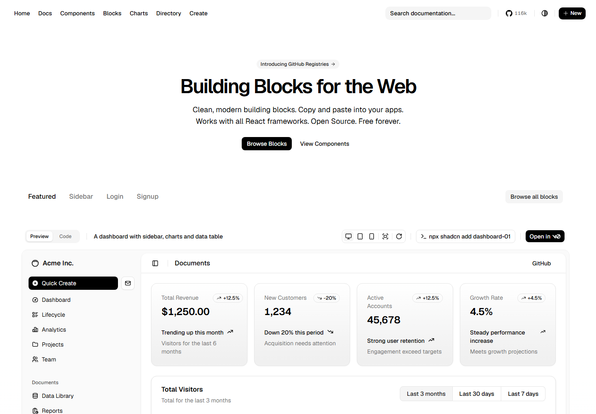

### B. 备选方案：Mantine 完整 React UI kit

如果你更偏好一个维护良好、组件完整、少一些 copy-paste 组件所有权负担的 UI 库，可以选这个。

- 最适合：组件覆盖面、表单、应用壳、响应式布局。
- 可复用：组件 API、hooks、中性的产品视觉。
- 风险：从当前 Ant Design 栈迁移成本更高，而且仍然需要为三端做定制化设计。

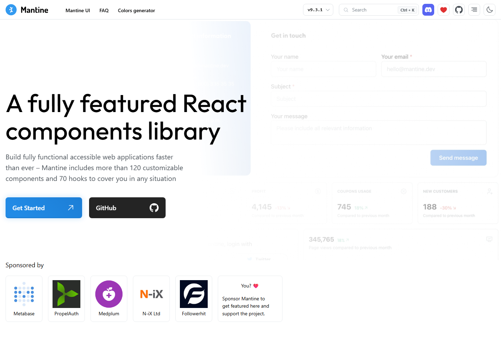

### C. 快速但不推荐：Ant Design Pro 风格的主办方后台

只有在“速度优先于视觉成熟度”时才考虑这个。

- 最适合：高密度主办方表格、审批页、详情页，以及熟悉的企业后台模块。
- 可复用：数据密度、表格/详情结构。
- 风险：会重复当前问题，产品看起来仍然像通用后台 dashboard。

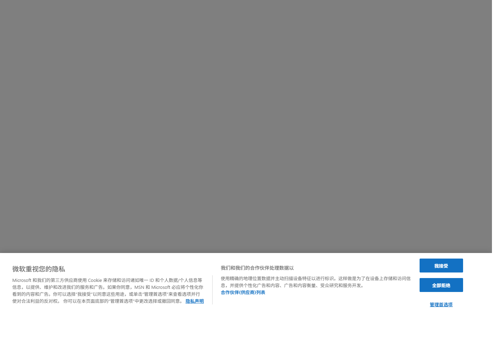

## 模板 / UI Kit 参考

### shadcn/ui

结论：主推荐方向。

参考价值：这是最适合做现代产品界面的方向，可以适配成不同角色端，而不需要引入一个完整后台框架。


### Mantine

结论：备选方向。

参考价值：组件体系完整、默认视觉干净、文档质量好。如果我们希望使用一个完整 UI 库，而不是维护 shadcn 风格的自有组件，Mantine 是更稳的备选。


### Semi Design

结论：只做视觉参考。

参考价值：组件风格清爽、节奏专业。但当前 MVP 没有必要为了这个从 Ant Design 迁移到 Semi。

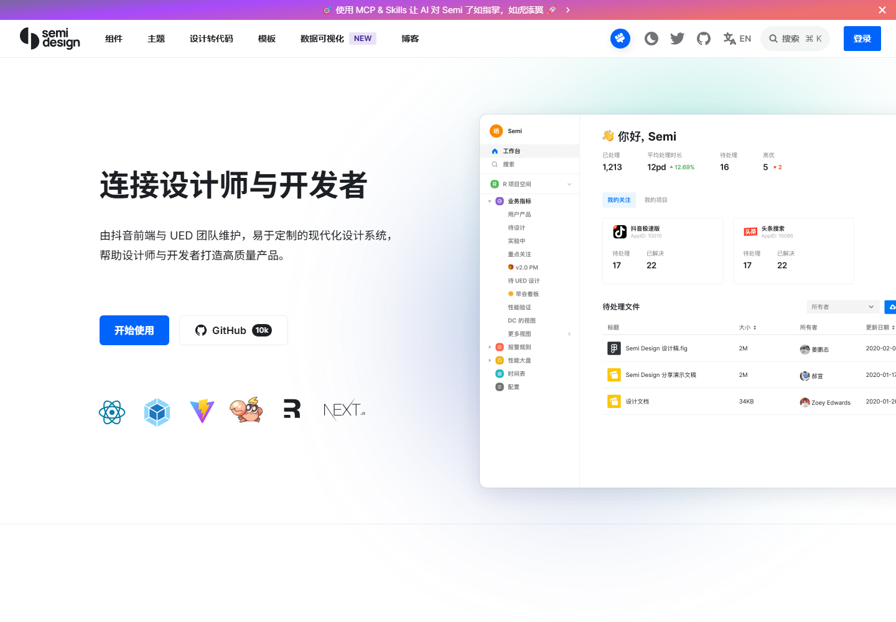

### Tremor

结论：只做复盘/指标页参考。

参考价值：适合 metric-backed review center、KPI 面板、运营分析。

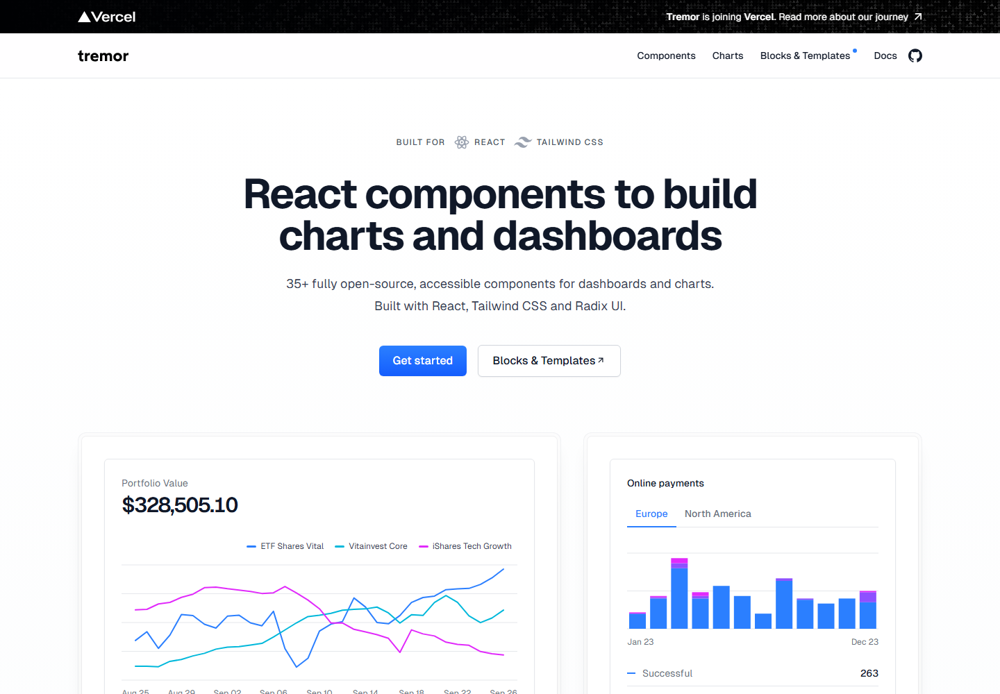

### Flowbite React

结论：只做移动端/平板端组件参考。

参考价值：简单的 Tailwind 组件可以帮助商户端和用户端，但整体辨识度不如 shadcn。

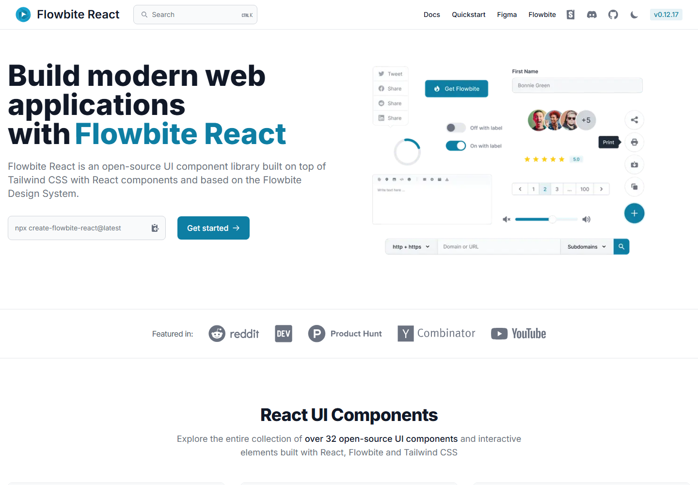

### Radix Themes

结论：只做基础组件和主题参考。

参考价值：可访问性基础组件和可控主题语言不错。但它是底层基础，不是完整产品模板。

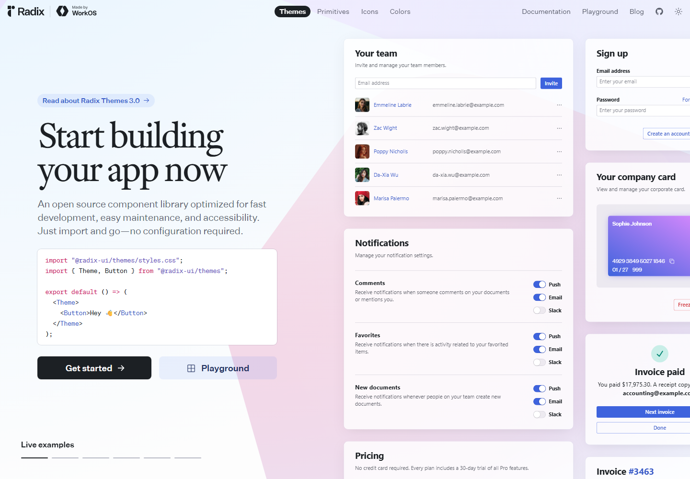

## 按角色划分的产品视觉参考

### 用户/游客 H5：Luma

可借鉴：活动身份感、移动优先的活动页层级、直接行动入口、强视觉记忆点。

要避免：过于派对化、娱乐化的风格；如果大 hero 弱化旧区路线产品感，就不应照搬。

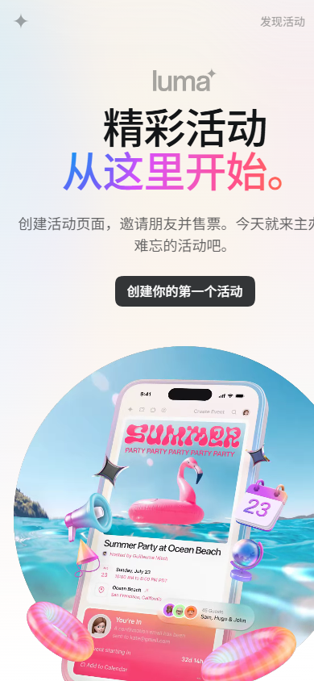

### 用户/游客路线：Wanderlog

可借鉴：路线/行程心智模型，把 stop/route point 作为主要对象，以及旅行计划结构。

要避免：完整旅行规划器复杂度、协作旅行计划、预订功能、重地图功能。

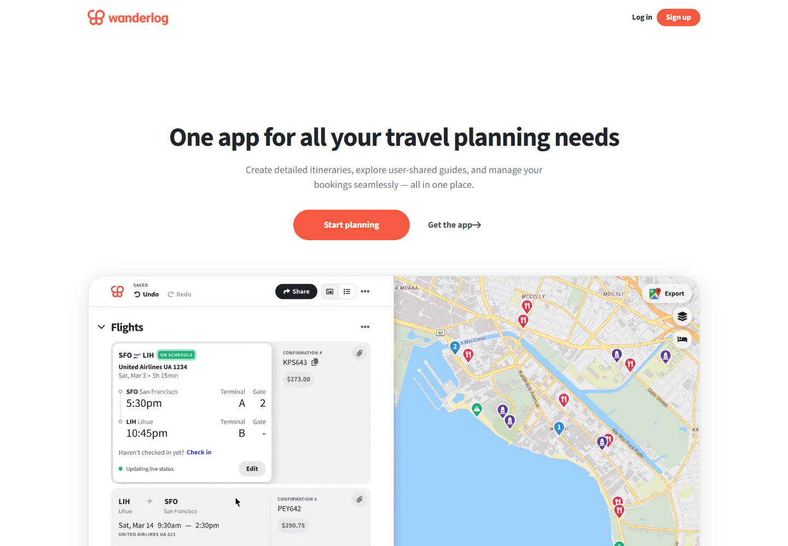

### 用户/游客路线：Roadtrippers

可借鉴：路线顺序、站点优先叙事、旅程感。

要避免：真实地图 API 和长途自驾旅行假设。

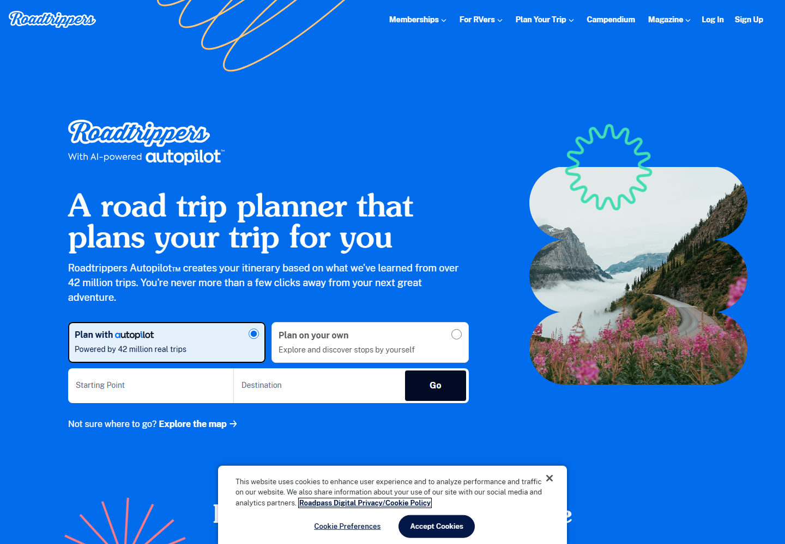

### 商户工作台：Clover POS

可借鉴：商户语境、直接的运营操作框架、触控优先的工作流。

要避免：硬件、POS、支付范围。本项目只需要商户任务和状态上报，不做真实交易。

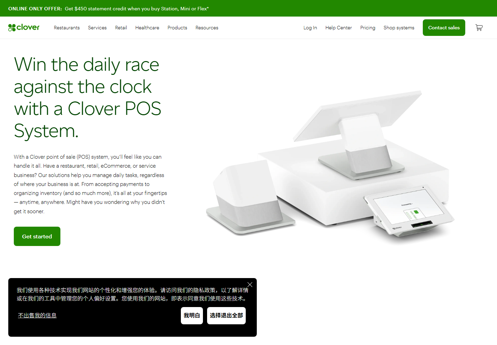

### 主办方异常中心：Datadog Incident Response

可借鉴：异常列表、严重程度标签、时间线、详情面板、基于证据的恢复/复盘表达。

要避免：SRE 可观测性产品复杂度，以及真实告警集成。

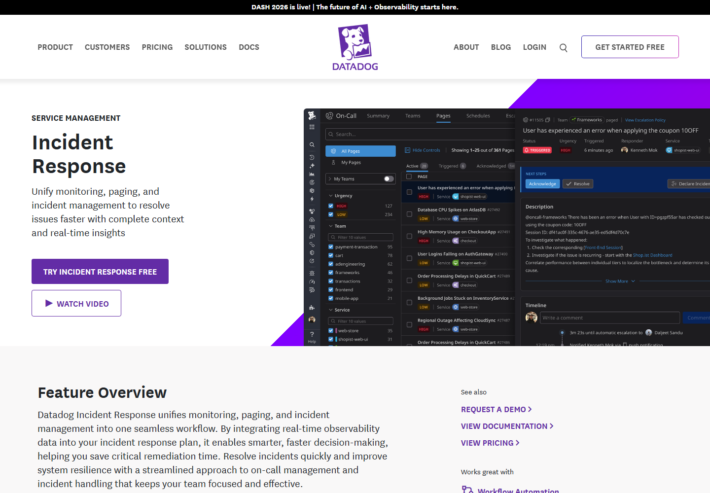

### 主办方活动运营：Eventbrite Organizer

可借鉴：以活动对象为中心，主办方工作流和用户/参会者视图分离，运营入口清楚。

要避免：票务、支付、营销 SaaS 范围。

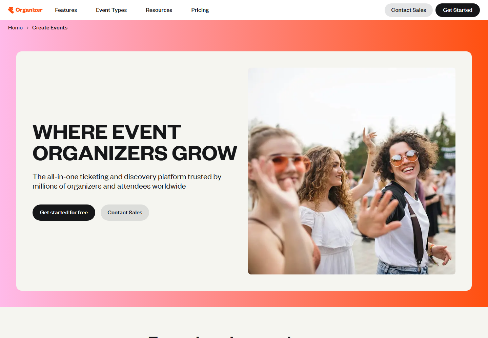

### 高密度产品质感：Linear

可借鉴：紧凑运营布局、克制色彩、清晰字体层级、工作队列感。

要避免：纯深色 issue tracker 风格，以及软件项目术语。

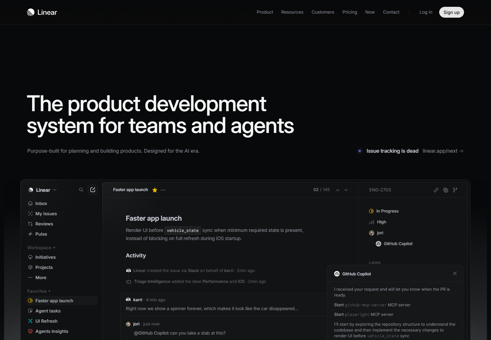

## 决策矩阵

| 方案 | 视觉成熟度 | 非后台感 | 三端适配 | 迁移成本 | 建议 |
| --- | ---: | ---: | ---: | ---: | --- |
| A. shadcn/ui 风格混合方案 | 5 | 5 | 5 | 3 | 默认选择 |
| B. Mantine 完整 UI kit | 4 | 4 | 4 | 4 | 如果拒绝 Tailwind/shadcn，则用它做备选 |
| C. Ant Design Pro 风格 | 3 | 2 | 3 | 2 | 快，但大概率仍然太像后台 |
| D. Semi Design 迁移 | 4 | 4 | 3 | 4 | 视觉可参考，现在不值得迁移 |
| E. Tremor-only 指标风格 | 4 | 3 | 2 | 3 | 只适合作为复盘中心灵感 |

## 我的建议

选择 A：

```text
shadcn/ui 风格的角色分端产品界面
+ 现有 Ant Design 作为迁移桥
+ Luma / Wanderlog 用于游客 H5 和路线体验
+ Clover 用于商户任务/状态上报工作台
+ Datadog / Linear / Eventbrite 用于主办方运营端
```

这个方案最有机会摆脱当前“通用后台 demo”的感觉，同时不需要一次性重写整个前端栈。

## 需要你决定

你可以直接回复：

1. `选 A`：采用 shadcn/ui 风格混合方案，进入下一阶段实现。
2. `选 B`：采用 Mantine 作为主 UI kit 方向。
3. `继续调研`：先继续补更多截图和视觉参考，再决定。
