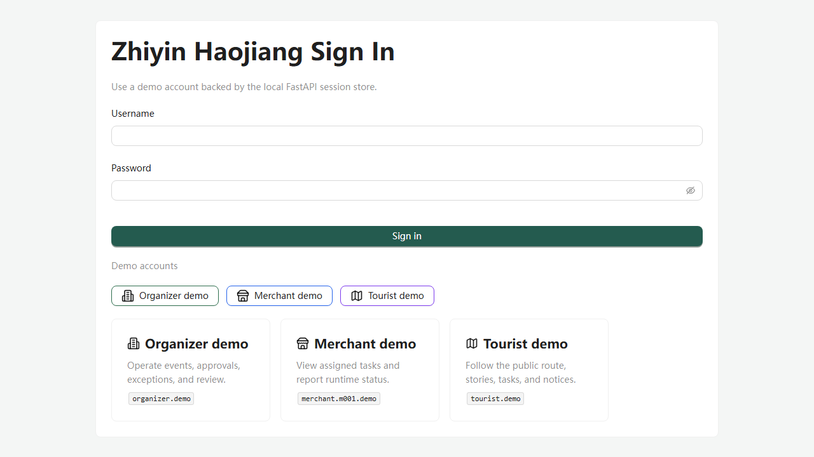
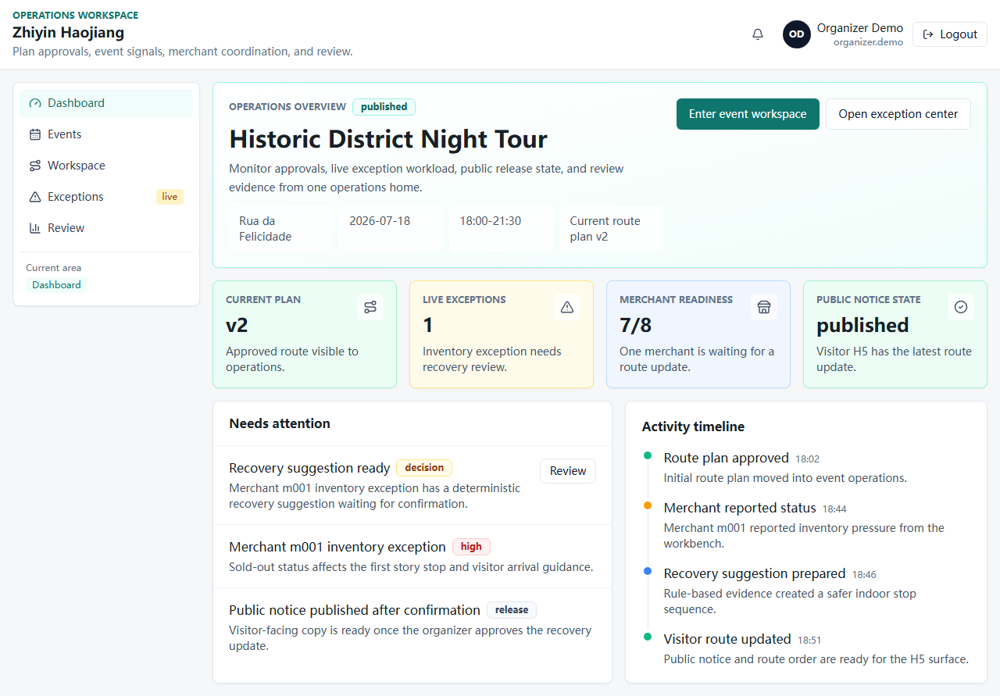
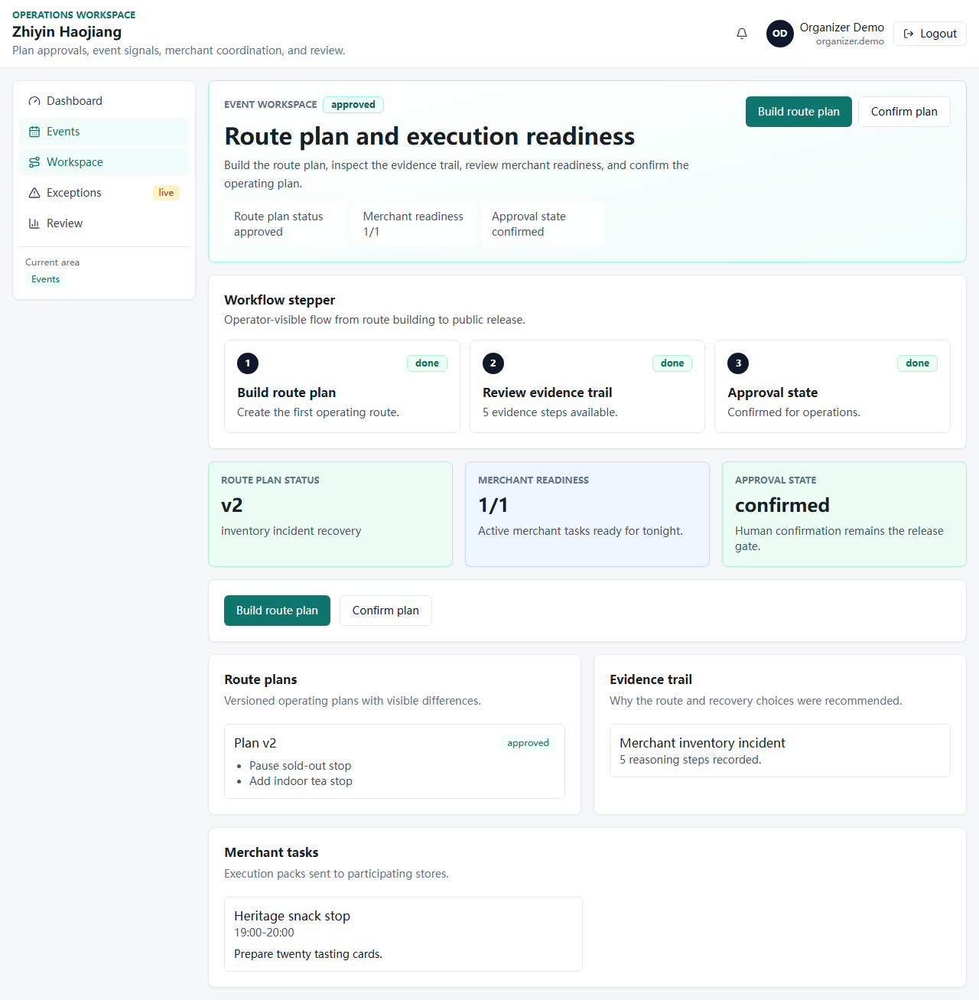
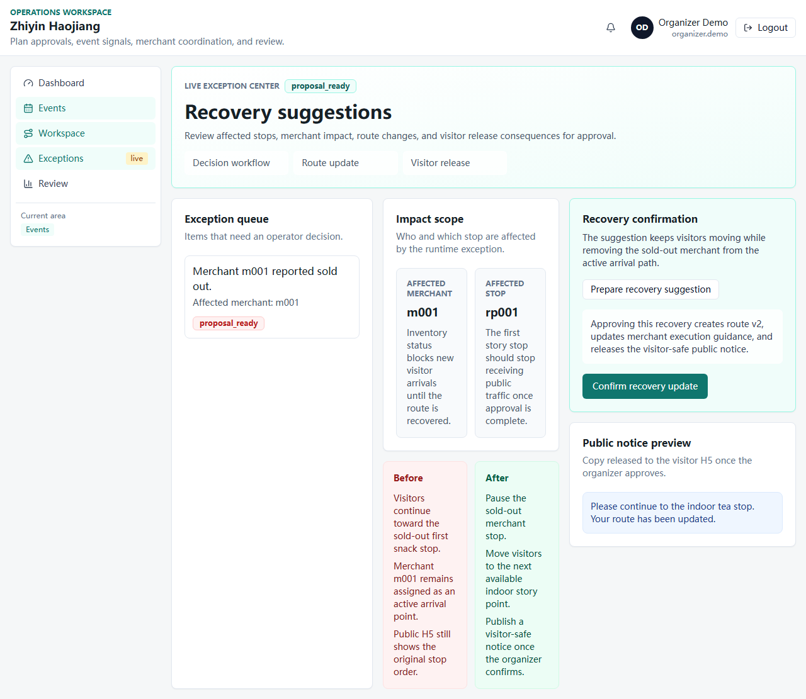
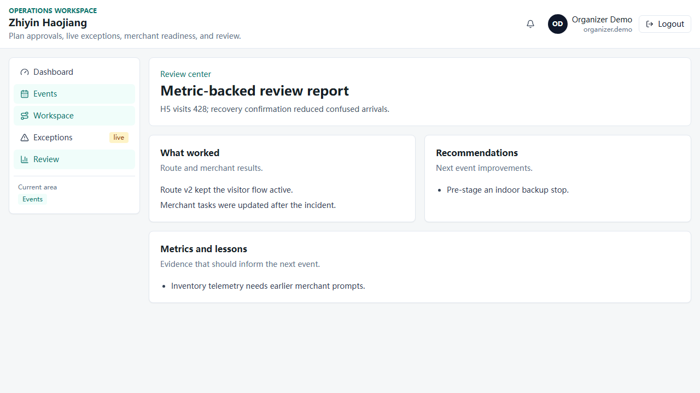
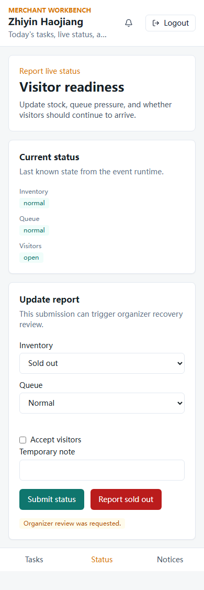
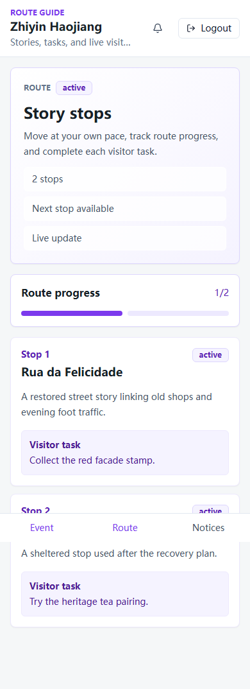
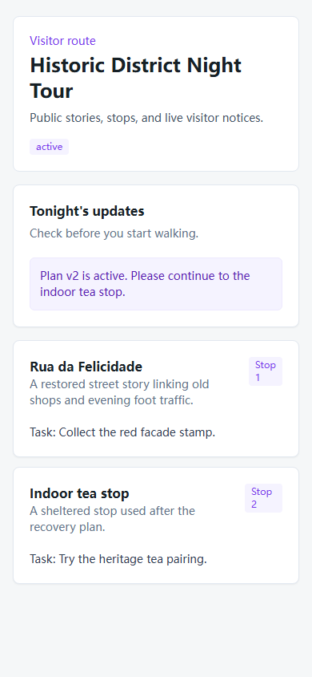

# v0.4 Visual Smoke 截图索引

生成时间：2026-06-10

执行命令：

```powershell
cd <PROJECT_ROOT>\apps\web
npm.cmd exec playwright test
```

说明：本轮 Playwright 使用独立 Vite 端口 `5178`，并通过 mock API 验证登录、主办方、商户、游客与公开 H5 路由。截图用于检查页面是否真实套用产品 shell、Tailwind 样式和分端信息架构。

| 文件 | 路由 / 场景 | 关注点 |
| --- | --- | --- |
| `assets/v0.4-verification/01-login.png` | `/login` | demo 账号登录入口、表单、三角色入口 |
| `assets/v0.4-verification/02-organizer-dashboard.png` | `/organizer/dashboard` | 主办方运营首页、活动状态、指标卡、侧边导航 |
| `assets/v0.4-verification/03-organizer-workspace.png` | `/organizer/events/demo-night-tour` | PlanVersion、AgentTrace、商户任务 |
| `assets/v0.4-verification/04-organizer-exceptions.png` | `/organizer/events/demo-night-tour/exceptions` | Incident 队列、恢复建议入口、v1 -> v2 变更 |
| `assets/v0.4-verification/05-organizer-review.png` | `/organizer/events/demo-night-tour/review` | metric-backed review report |
| `assets/v0.4-verification/06-merchant-status-mobile.png` | `/merchant/events/demo-night-tour/status` | 商户移动端状态上报、售罄触发异常反馈 |
| `assets/v0.4-verification/07-tourist-route-mobile.png` | `/user/events/demo-night-tour/route` | 游客端路线点、故事、任务 |
| `assets/v0.4-verification/08-public-h5-mobile.png` | `/public/events/demo-night-tour` | 公开 H5 projection、Plan v2 通知、路线点 |

## 快速预览

### 登录



### 主办方









### 商户端



### 游客端 / 公开 H5




