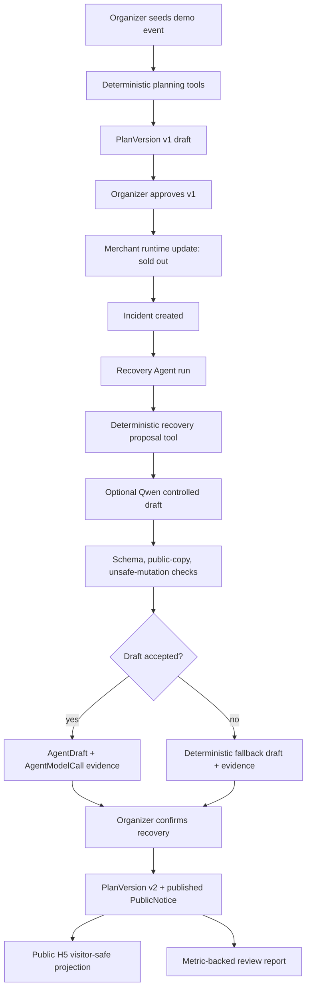

# v1.1 Architecture Brief

Date: 2026-06-14

## Core Claim

Zhiyin Haojiang is an auditable old-district cultural-tourism event operations Agent. It combines role-separated product surfaces, deterministic operational tools, controlled Agent evidence, optional Qwen draft generation, and organizer approval gates.

## System Layers

| Layer | Responsibility | Current implementation |
| --- | --- | --- |
| Product surfaces | Organizer, merchant, tourist, and public H5 experiences | React/Vite role routes |
| Backend workflow | Event, plan, incident, recovery, public projection, review | FastAPI + Pydantic + SQLite store |
| Deterministic tools | Route, merchant, incident, recovery, notice, review logic | Python services and Agent runtime |
| Agent evidence | Runs, steps, tool calls, drafts, model calls, evaluations | `AgentRun`, `AgentStep`, `AgentToolCall`, `AgentDraft`, `AgentModelCall`, `AgentEvaluation` |
| Optional Qwen lane | Controlled text drafts only | `AGENT_DRAFT_BACKEND=qwen` |
| Safety boundary | Human approval and public-copy guard | Organizer-only approval endpoints and validation |

## Runtime Flow

## Why Qwen Is Constrained

The model is strongest at drafting and summarizing text, but operational state must remain auditable. Therefore Qwen is allowed to draft:

- recovery explanation
- visitor-safe public notice
- review summary

Qwen is not allowed to:

- create or approve `PlanVersion`
- publish `PublicNotice`
- mutate merchant inventory, queue, or availability
- bypass organizer approval
- expose backend/model terms on public pages

## Evidence Objects

| Object | Why it matters |
| --- | --- |
| `AgentRun` | Records when a specialist Agent flow was triggered and whether fallback happened. |
| `AgentStep` | Shows specialist reasoning steps for planning and operations. |
| `AgentToolCall` | Shows deterministic tools used by the Agent runtime. |
| `AgentDraft` | Stores controlled draft outputs before human approval. |
| `AgentModelCall` | Records provider, model, prompt template, response status, and fallback. |
| `AgentEvaluation` | Records schema, public-copy, and unsafe-mutation guard evidence. |

## Demo Reliability

The stable demo does not require DashScope. When `AGENT_DRAFT_BACKEND` is unset or `deterministic`, the full loop runs through deterministic tools. When `AGENT_DRAFT_BACKEND=qwen` but the provider is unavailable or unsafe, the system records model-call evidence and falls back.

The current v1.1 recorded live-smoke artifact is `blocked` because no `DASHSCOPE_API_KEY` was present in the process environment. The same artifact records that the deterministic fallback probe completed.

## Current Non-Claims

- QwenPaw workflow orchestration is not implemented.
- Qwen does not autonomously update routes.
- Qwen does not approve recovery.
- Qwen does not publish visitor notices.
- The project is not connected to real POS, payment, traffic, hardware, or map APIs.
